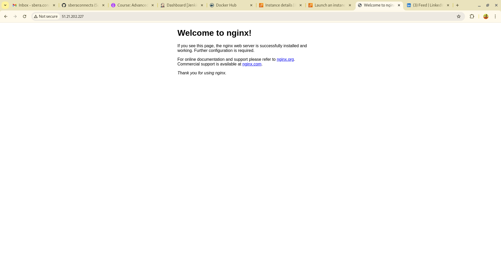

# 🚀 Terraform + Ansible DevOps Demo

This project showcases how to provision infrastructure using **Terraform** and configure it using **Ansible**, fully automated and ready for CI/CD integration via **GitHub Actions**.

## 🧰 Tech Stack

- 🏗️ Terraform (for infrastructure provisioning)
- 🧰 Ansible (for system configuration)
- ☁️ AWS EC2 (Ubuntu 22.04)
- 🤖 GitHub Actions (optional CI/CD)

## ✅ Prerequisites

Ensure the following tools are installed on your system (Tested on **Fedora 41**):

### Terraform
Follow the instructions at https://developer.hashicorp.com/terraform/downloads for manual install.

### Ansible
```bash
sudo dnf install -y ansible
```

### AWS CLI
```bash
curl "https://awscli.amazonaws.com/awscli-exe-linux-x86_64.zip" -o "awscliv2.zip"
unzip awscliv2.zip
sudo ./aws/install
aws configure
```

## 🚀 How to Deploy

1. Navigate to the terraform directory:
```bash
cd terraform
terraform init
terraform apply -auto-approve
```

2. Run Ansible:
```bash
cd ../ansible
ansible-playbook -i inventory.ini playbook.yml --private-key ~/.ssh/devops-key.pem -u ubuntu
```

## 🧹 Cleanup
```bash
./scripts/destroy.sh
```

## 🌐 Live Demo

This is the NGINX default page running on EC2 provisioned via Terraform + configured via Ansible:




---

## 🙌 Author

**Sudhir Kumar Bera**  
Senior Embedded Software Engineer → DevOps Enthusiast  
🌐 [GitHub](https://github.com/sberaconnects) | 📍 Oberhausen, Germany

